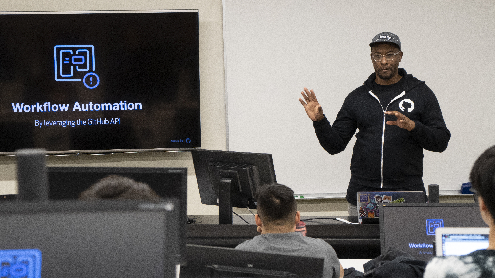

<link rel="stylesheet" href="https://cdn.jsdelivr.net/npm/bulma-carousel@4.0.4/dist/css/bulma-carousel.min.css">

  

    

      

        
      

      

        Students at the <a href="https://www.autodesk.com/technology-centers/san-francisco">AutoDesk Technology Center</a> field trip as part of the <a href="https://scholars.cs.usfca.edu/cs186-fall2019/">Community Engaged CS</a> course in 2019.
      

    

  

  

    

      

        
      

      

        Students at the <a href="https://www.lyft.com/careers">Lyft</a> field trip as part of the <a href="https://scholars.cs.usfca.edu/cs186-fall2019/">Community Engaged CS</a> course in 2019.
      

    

  

  

    

      

        
      

      

        <a href="https://twitter.com/bdougieYO">Brian Douglas</a>, Developer Advocate at Github.com, speaking to students as part of the <a href="https://scholars.cs.usfca.edu/cs186-fall2019/">Community Engaged CS</a> course in 2019.
      

    

  

  

    

      

        
      

      

        Students at the <a href="https://www.autodesk.com/technology-centers/san-francisco">AutoDesk Technology Center</a> field trip as part of the <a href="https://scholars.cs.usfca.edu/cs186-fall2019/">Community Engaged CS</a> course in 2019.
      

    

  
  

{{ site.description }}

<!-- Classes are **Mondays** from **4:45pm&ndash;6:20pm** in LS G12, and are often open to non-enrolled students. -->

The class schedule is pending. See the [Schedule](schedule.html) and [Syllabus](syllabus.html) for more information.

  <button class="delete"></button>
  
<strong>Interested in registering?</strong> You must be a first-time first-year incoming CS major to register. If that applies, please contact <a href="https://sjengle.cs.usfca.edu">Professor Sophie Engle</a> at <a href="mailto:sjengle@cs.usfca.edu">sjengle@cs.usfca.edu</a> for instructions on how to register.

  <button class="delete"></button>
  
This course is funded by under <a href="https://www.nsf.gov/awardsearch/showAward?AWD_ID=1833718">NSF Grant No. 1833718</a>. As part of grant expectations, an external evaluation of project usefulness and impact will be conducted by <a href="http://smartstart-er.com/">SmartStart Evaluation and Research</a>. They will contact you to participate in one or more surveys.

  
<strong>All participants are requested to participate in the project evaluation.</strong> These surveys are to evaluate our program (the course) and not you (the student), and will not impact your grades in any way. See the <a href="syllabus.html#evaluation">Syllabus</a> for details.

